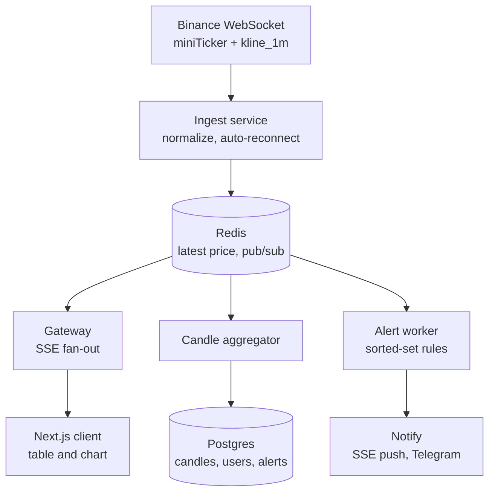

# FlashCrypto — Plan và System Design

Dashboard giá crypto real-time: bảng giá live, biểu đồ nến, cảnh báo giá.

> Các con số ước lượng và chi tiết về Binance trong tài liệu này là ước tính, cần đo lại và kiểm tra docs hiện hành trước khi dựa vào.

---

## 1. Yêu cầu và con số ước lượng

### Chức năng
- Bảng giá live cho khoảng 20 cặp coin.
- Biểu đồ nến (lịch sử cộng nến đang chạy).
- Cảnh báo giá theo tài khoản.
- Thông báo qua trình duyệt và Telegram.

### Phi chức năng (mục tiêu đo được)
- Độ trễ từ lúc ingest nhận tick đến lúc gateway ghi xuống client: p95 dưới 500ms.
- Hỗ trợ 1.000 kết nối SSE đồng thời trên một instance gateway.
- Mất kết nối tới Binance thì tự phục hồi, không để lại khoảng trống trên biểu đồ.
- Đường live (giá đến trình duyệt) không phụ thuộc Postgres.

### Ước lượng nhanh
- Đầu vào: 20 symbol × 1 cập nhật/giây ≈ 20 message/s.
- Đầu ra: 1.000 client × ~2 frame/s (gộp mỗi 200-500ms) ≈ 2.000 frame/s, mỗi frame vài trăm byte, tổng khoảng vài trăm KB/s. Một instance Node gánh được.
- Nến 1 phút: 20 × 1.440 ≈ 29k dòng/ngày, khoảng 10 triệu dòng/năm. Postgres thường thừa sức, chưa cần TimescaleDB.

---

## 2. Kiến trúc tổng thể



Chú thích: Ingest, Gateway, Aggregator, Alert worker là các service. Redis và Postgres là kho dữ liệu. Binance, client và Notify là bên ngoài.

---

## 3. Các quyết định thiết kế

1. **Modular monolith, tách process.** Một codebase NestJS nhưng chạy 3 process: `ingest`, `api` (REST + SSE + auth) và `worker` (aggregator, alert, backfill). Scale từng phần độc lập mà không gánh chi phí vận hành microservices.
2. **Chọn stream đúng mức chi tiết.** Sử dụng **Binance Combined Stream** (`wss://stream.binance.com:9443/stream?streams=...`) để gom toàn bộ stream của 20 cặp coin (`miniTicker` và `kline_1m`) qua **1 kết nối WebSocket duy nhất**. Aggregator chỉ lưu khi nến 1m đóng (cờ `x` = true).
3. **Chế độ nâng cao (tùy chọn):** tự gom nến từ stream `trade`, rồi dùng kline của Binance làm đáp án chuẩn để kiểm tra độ chính xác.
4. **Đường hot chỉ đi qua Redis.** Ingest ghi `price:latest` và publish, gateway chỉ đọc Redis. Postgres chết thì giá live vẫn chạy.
5. **SSE và hạ tầng truyền tải:**
   - Sử dụng SSE vì luồng chỉ đi một chiều (server đẩy xuống), `EventSource` tự reconnect.
   - **Giới hạn kết nối (Browser limits):** Bắt buộc chạy qua reverse proxy hỗ trợ **HTTP/2** (Nginx/Caddy với `X-Accel-Buffering: no`) để tránh chạm trần 6 connection/domain của HTTP/1.1 khi mở nhiều tab.
   - **Dynamic Subscription:** Với 20 cặp coin, Gateway có thể broadcast toàn bộ snapshot & delta (băng thông chỉ vài chục KB/s), UI client lọc hiển thị; hoặc Client ngắt và mở lại SSE với query param mới khi đổi danh sách theo dõi.
   - **Xác thực:** Dùng cookie `httpOnly` hoặc token ngắn hạn trong query param vì `EventSource` chuẩn không hỗ trợ custom header `Authorization`.
6. **Snapshot rồi delta.** Client vừa kết nối được gửi ngay giá mới nhất từ Redis, sau đó nhận cập nhật. Giá là dữ liệu "trạng thái mới nhất" nên không cần replay sự kiện cũ.
7. **Conflation thay vì queue.** Với mỗi client, gateway chỉ giữ tick mới nhất của mỗi symbol trong cửa sổ 200-500ms rồi flush. Client chậm thì bỏ dữ liệu cũ, không để hàng đợi phình ra.
8. **Tiền và giá dùng `Decimal`/string**, không dùng `float`, từ đầu vào tới DB. Chỉ chuyển sang number ở tầng hiển thị.

---

## 4. Data model

### Redis
| Key | Kiểu | Mô tả |
|---|---|---|
| `prices` | hash | field là symbol, value là JSON `{p, ts, chg24h}` |
| `tick:{symbol}` | pub/sub channel | tick giá mới |
| `kline:{symbol}:1m` | pub/sub channel | nến đang chạy |
| `alerts:{symbol}:above` | sorted set | score là ngưỡng giá, member là `alertId` |
| `alerts:{symbol}:below` | sorted set | như trên, cho chiều giảm |
| `lock:ingest` | string (`SET NX PX`) | khóa lãnh đạo cho chế độ 2 instance ingest |

### Postgres (Prisma)
- `Instrument(symbol PK, base, quote, pricePrecision, active)`
- `Candle(symbol, interval, openTime, open, high, low, close, volume)` — khóa chính `(symbol, interval, openTime)`
- `User(id, email, passwordHash, createdAt)`
- `Alert(id, userId, symbol, direction, threshold, status, channel, createdAt, triggeredAt)`

Lưu nến 1 phút là nguồn gốc. Để tính các khung nến lớn hơn (5m, 15m, 1h):
- *Cách 1 (Query-time aggregation):* Dùng Window Functions (`FIRST_VALUE`, `LAST_VALUE`) gom theo `date_bin` trên Postgres 14+.
- *Cách 2 (Rollup Worker):* Khi nến 1m đóng, worker tự động rollup và ghi vào bảng nến các khung lớn hơn để tối ưu tốc độ đọc biểu đồ lịch sử dài.

### API
Giữ response shape `{ data, meta, error }` như iKnowBall.

| Endpoint | Ghi chú |
|---|---|
| `GET /api/v1/instruments` | danh sách cặp coin |
| `GET /api/v1/candles?symbol=&interval=&from=&to=&limit=` | lịch sử nến |
| `GET /api/v1/stream?symbols=` | SSE giá (hỗ trợ HTTP/2) |
| `POST\|GET\|DELETE /api/v1/alerts` | cần JWT |
| `GET /api/v1/me/stream` | SSE thông báo alert |

---

## 5. Các bài toán khó

### Reconnect và lấp khoảng trống
Binance ngắt kết nối định kỳ (kiểm tra docs hiện hành về thời hạn 24h và ping/pong). Ingest cần heartbeat, reconnect với exponential backoff kèm jitter. Sau khi nối lại, gọi REST klines từ `openTime` cuối cùng đã lưu đến hiện tại và upsert. Khóa chính giúp việc này idempotent.

### Nến live khớp với lịch sử
Client gọi REST lấy lịch sử, trong lúc đó buffer các sự kiện SSE, rồi merge theo `openTime` khi lịch sử về. Nếu không buffer sẽ bị mất hoặc lặp nến ở điểm nối. Frontend sử dụng thư viện `lightweight-charts` (chú ý SSR check trên Next.js).

### Fan-out ở gateway
Gateway giữ map `symbol -> Set<client>`, chỉ subscribe Redis channel khi có ít nhất một client quan tâm (đếm tham chiếu). Khi hàng trăm client cùng subscribe một symbol thì parse một lần, write nhiều lần. Đảm bảo cấu hình không buffer stream (`X-Accel-Buffering: no`).

### Alert engine
- Mỗi tick chỉ truy vấn hai sorted set của đúng symbol đó: `ZRANGEBYSCORE above -inf p` và `ZRANGEBYSCORE below p +inf`.
- Tránh bắn hai lần khi có nhiều worker: dùng kết quả của `ZREM` làm "quyền sở hữu". Worker nào `ZREM` trả về 1 mới được xử lý.
- Postgres là nguồn sự thật, Redis chỉ là chỉ mục. Khi khởi động phải dựng lại từ DB.
- Để tránh cảnh báo nhấp nháy quanh ngưỡng, cân nhắc trạng thái "đã kích hoạt" và tạm khóa vài giây.

### Điểm đơn lỗi (SPOF) ở ingest
Bản đầu chạy một instance là đủ. Bản nâng cao chạy hai instance: một cái giữ khóa `lock:ingest` (lease có TTL, tự gia hạn), cái còn lại chờ tiếp quản.

### Độ mới của dữ liệu
Mỗi tick mang `ts` của sàn. Gateway đánh dấu client "stale" nếu quá N giây không có tick, UI hiện cảnh báo để người dùng không nhìn nhầm giá cũ là giá live.

---

## 6. Bảng lỗi và cách hệ thống phản ứng

| Sự cố | Hành vi mong muốn |
|---|---|
| Mất kết nối Binance | Reconnect có backoff, UI hiện "stale", backfill nến sau khi nối lại |
| Redis chết | Ingest bỏ tick (giá là trạng thái mới nhất nên chấp nhận mất), gateway báo not-ready, client tự reconnect |
| Postgres chết | Đường live vẫn chạy, worker retry với hàng đợi bộ nhớ có giới hạn, alert tạm ngừng tạo mới |
| Gateway crash | `EventSource` tự nối lại, nhận snapshot rồi tiếp tục |
| Ingest crash | Restart hoặc standby tiếp quản, backfill lấp khoảng trống |

---

## 7. Cấu trúc repo

```
flashcrypto/
├── apps/
│   ├── ingest/
│   ├── api/
│   ├── worker/
│   └── web/
└── libs/
    ├── market-data/   (MarketDataProvider, tick schema bằng zod)
    ├── redis-keys/
    └── db/            (Prisma)
```

`MarketDataProvider` là interface (`connect`, `subscribe`, `onTick`, `getHistory`). Cài `BinanceProvider` trước, sau này thêm Coinbase/Kraken/OKX chỉ cần thêm adapter.

---

## 8. Lộ trình

Ước tính cho làm bán thời gian, điều chỉnh theo lịch thực tế.

### Phase 0: Nền tảng (2-3 ngày)
- Monorepo, Docker Compose (Postgres, Redis), Prisma schema.
- `libs/market-data` với tick schema và tests.
- **Xong khi:** `docker compose up` chạy được, schema migrate thành công.

### Phase 1: Ingest (1 tuần)
- `BinanceProvider` với heartbeat, backoff, resubscribe.
- Chuẩn hóa tick, ghi Redis và publish.
- **Xong khi:** rút mạng 30 giây rồi cắm lại, hệ thống tự phục hồi mà không cần can thiệp.

### Phase 2: Gateway và bảng giá (1 tuần)
- SSE với snapshot + delta, conflation theo client, đếm tham chiếu subscription.
- Next.js hiển thị bảng giá, badge stale.
- **Xong khi:** mở 3 tab với danh sách symbol khác nhau, mỗi tab chỉ nhận đúng symbol của mình.

### Phase 3: Nến và biểu đồ (1-1.5 tuần)
- Worker lưu nến đóng, endpoint candles, backfill khi khởi động và sau reconnect.
- `lightweight-charts` merge lịch sử với nến live.
- **Xong khi:** không có khoảng trống hay nến lặp sau khi ép ngắt kết nối.

### Phase 4: Tài khoản và alert (1 tuần)
- JWT, CRUD alert, engine dùng sorted set.
- Thông báo qua SSE và Telegram bot.
- **Xong khi:** tạo alert rồi gây tick vượt ngưỡng (mock provider), alert bắn đúng một lần dù chạy hai worker.

### Phase 5: Quan sát và load test (1 tuần)
- `/metrics`: kết nối mở, tick/s, độ trễ ingest→write, độ tuổi tick.
- Dashboard Grafana.
- Load test 1.000 kết nối (k6 hoặc script Node tự viết).
- Chaos test: kill ingest/Redis giữa chừng.
- **Xong khi:** README có bảng số đo thật so với mục tiêu ở mục 1.

### Phase 6: Hoàn thiện (3-5 ngày)
- README với sơ đồ và mục "Các quyết định thiết kế".
- GIF demo, deploy.

---

## 9. Mở rộng và ngoài phạm vi

### Mở rộng nếu còn thời gian
- Order book (`depth` stream).
- Failover đa sàn.
- Leader election cho ingest.
- Tự gom nến từ `trade` và đối chiếu với kline của Binance.

### Ngoài phạm vi
- Đặt lệnh giao dịch.
- Forex.
- Phân tích/dự đoán giá.
