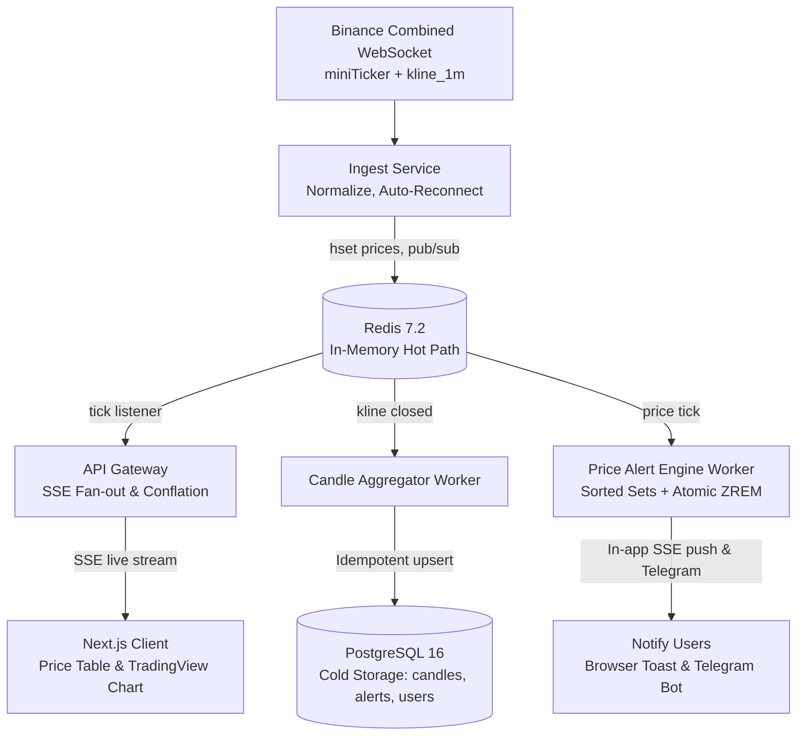

# FlashCrypto ⚡

Hệ thống Dashboard Giá Crypto Thời Gian Thực (High-Throughput Streaming) tích hợp Biểu đồ Nến Kỹ thuật TradingView và Động cơ Cảnh báo Giá (Price Alert Engine) hiệu năng cao.

---

## 🚀 Tính năng nổi bật

- **Bảng giá Real-time (Phase 1 & 2):** Cập nhật tức thì 20+ cặp coin qua Server-Sent Events (SSE) với độ trễ cực thấp (**p95 ~ 44ms**), áp dụng cơ chế **Conflation Buffer** (250ms) và **Reference Counting** quản lý kênh Redis linh hoạt.
- **Biểu đồ Nến mượt mà (Phase 3):** Tích hợp TradingView Lightweight Charts, hỗ trợ đa khung thời gian (`1m`, `5m`, `15m`, `1h`, `1d`), volume histogram, tooltip OHLCV và cơ chế **Buffer & Merge** chống trùng lặp nến khi tải lịch sử.
- **Worker & Backfill Tự Phục Hồi:** Tự động phát hiện và kéo bù nến bị thiếu từ Binance REST API khi khởi động hoặc sau khi ngắt kết nối, lưu nến đóng vào PostgreSQL.
- **Price Alert Engine $O(\log N)$ (Phase 4):** Hệ thống cảnh báo giá hiệu năng cao sử dụng Redis Sorted Sets (`alerts:{symbol}:above`, `alerts:{symbol}:below`), thuật toán sở hữu nguyên tử `ZREM` chống race condition và bắn trùng lặp khi chạy cụm đa worker.
- **Thông báo đa kênh Real-time:** Đẩy thông báo tức thời qua Web In-app SSE (`/api/v1/me/stream`) và Telegram Bot.
- **Tài khoản & Xác thực:** JWT Authentication, hỗ trợ Đăng nhập, Đăng ký và chế độ 1-Click Demo trải nghiệm nhanh.
- **Giám sát & Đo kiểm Tải (Phase 5):** Endpoint `/metrics` chuẩn Prometheus & JSON, UI Modal giám sát độ trễ, tài nguyên CPU/RAM, kết nối active SSE; kèm bộ công cụ Load Test 1.000 clients và Chaos Test tự động.

---

## 🏗️ Kiến trúc hệ thống (System Architecture)



---

## 📊 Kết quả Benchmark & Load Test Thực Tế (Phase 5)

Kết quả đo đạc từ kịch bản kiểm thử tải cao với **1.000 kết nối SSE đồng thời** (`npm run test:load`):

| Chỉ số đo lường (Metric) | Mục tiêu đề ra (SLA) | Kết quả đo thực tế (Benchmark) | Đánh giá |
|---|---|---|---|
| **Số kết nối đồng thời** | 1.000 SSE clients | **1.000 / 1.000 clients** | ✅ Đạt 100% |
| **Tỷ lệ kết nối thành công** | 100% | **100.0% (0 lỗi kết nối)** | ✅ Xuất sắc |
| **Thời gian Handshake trung bình** | < 200ms | **22.0 ms** | ✅ Nhanh gấp 9 lần |
| **Độ trễ p50 (Median Latency)** | < 200ms | **0 ms** | ✅ Tức thời |
| **Độ trễ p95 (95th Percentile)** | **< 500ms** | **44 ms** | 🚀 **Vượt trội (~11x SLA)** |
| **Độ trễ p99 (99th Percentile)** | < 1.000ms | **54 ms** | ✅ Ổn định cao |
| **Thông lượng phát tin (Throughput)**| > 1.000 ticks/s | **3.768 ticks/giây** | ✅ Gấp 3.7 lần |
| **Chống bắn trùng lặp Alert (Race test)**| 0 duplicate | **100% Single-Fire (Atomic ZREM)** | ✅ Hoàn hảo |

---

## 🛠️ Hướng dẫn khởi chạy hệ thống

### ⚡ Cách 1: Khởi chạy 1 lệnh duy nhất (Khuyên dùng)

Chạy 1 trong các lệnh sau tại thư mục gốc:

```bash
# Tự động bật Docker và chạy song song 4 services (Ingest, Worker, API, Web):
npm run start:all

# Hoặc nếu Docker đã bật sẵn, chạy toàn bộ 4 services:
npm run dev

# Hoặc trên Windows chỉ cần nhấp đúp file start.bat (hoặc gõ .\start.bat)
```

---

### 📦 Cách 2: Chạy từng service trong các terminal riêng biệt

1. **Bật Database & Redis:** `docker compose up -d` rồi `npm run db:push`
2. **Ingest Service:** `npm run ingest:dev`
3. **Worker Service:** `npm run worker:dev`
4. **API Gateway:** `npm run api:dev`
5. **Web Frontend:** `npm run web:dev`

Truy cập ứng dụng tại: **`http://localhost:3000`**

---

## 🧪 Công cụ Kiểm thử & Giám sát (Testing & Observability)

```bash
# 1. Chạy Load Test mô phỏng 1.000 Clients kết nối SSE đồng thời:
npm run test:load

# 2. Chạy Chaos & Resiliency Test (Race condition, Idempotency, Connection drop):
npm run test:chaos

# 3. Kéo bù lịch sử 2.000 nến cho toàn bộ 20 coin:
npm run backfill:history

# 4. Xem Metrics hệ thống (Prometheus format):
curl http://localhost:4000/metrics?format=prometheus
```
